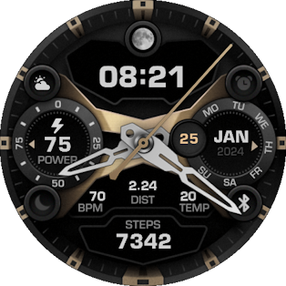
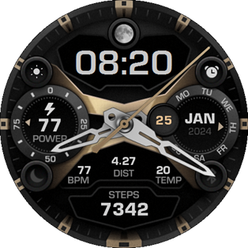

# My watchfaces for GTR4

## Mechanics_GTR4_jam_v2.4

 

## Mechanics_GTR4_jam_v3.0
1. Time display is now made with the font "Eurostile URW Bold". The size of the time symbols has been increased.
(Y-position in "GTR4 Watchface Editor" and on watches do not match)
2. Weekday arrow layer moved above the month layer

 

